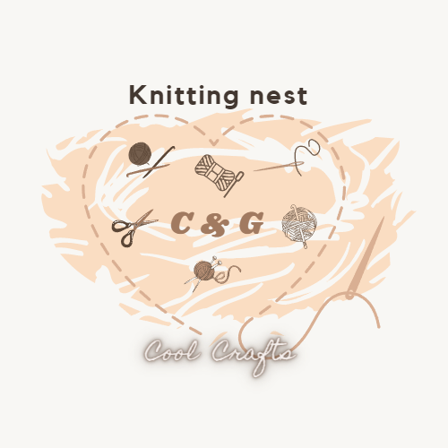
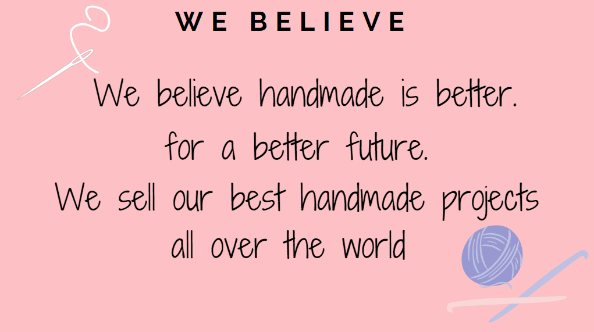
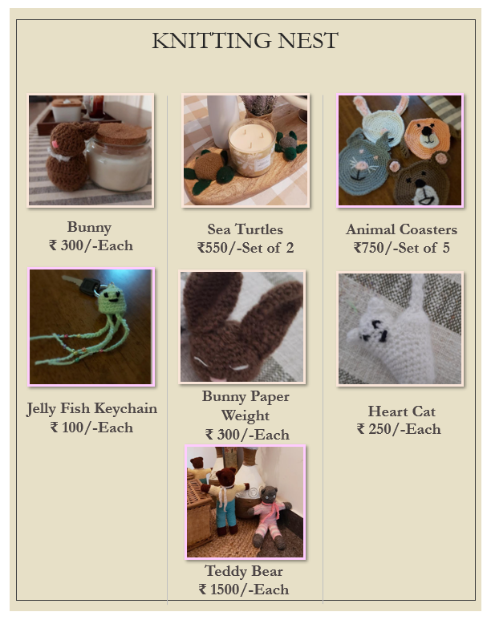
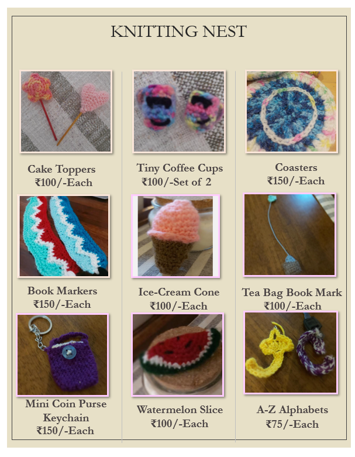
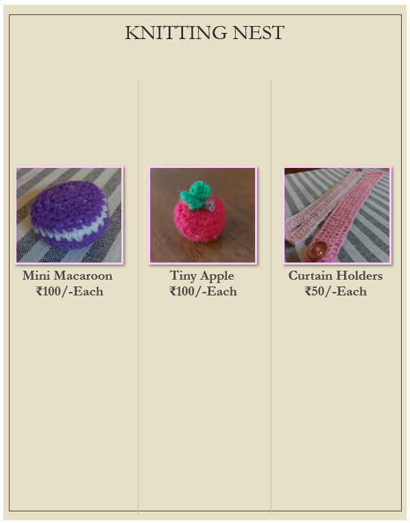
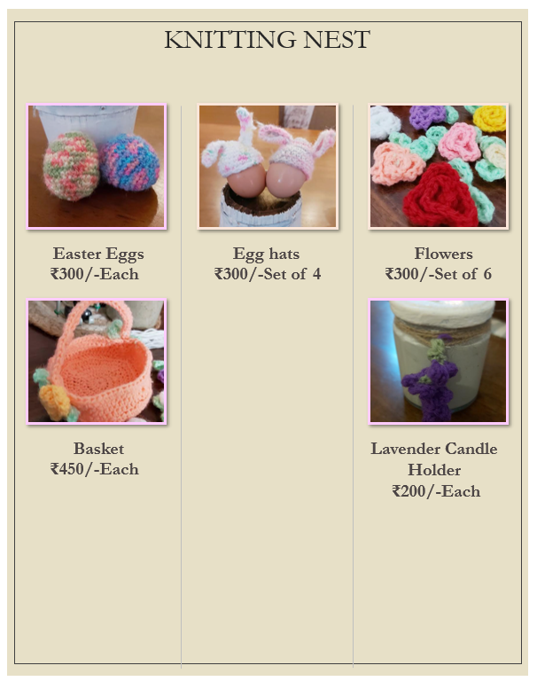
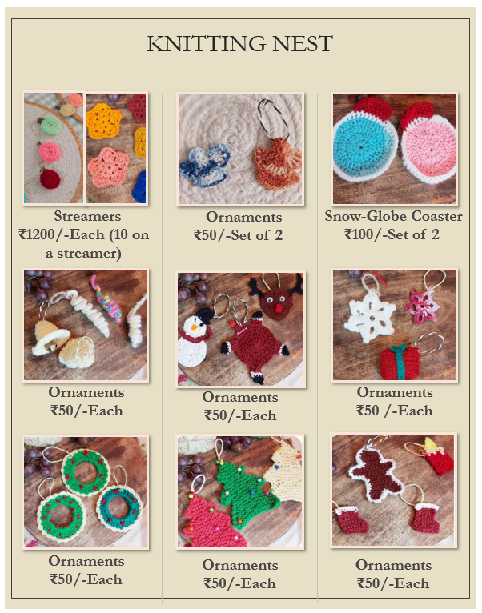
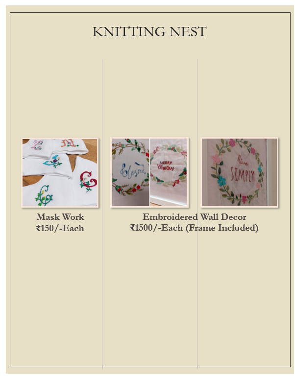

<!DOCTYPE html>
	<head>
		<title> Knitting Nest </title>
		<link rel="icon" type="images/Knitting_Nest_Logo.png" href="Knitting_Nest_Logo.png">
		
	</head>
	<body>
		 
		 
		 
		 
			&nbsp&nbsp&nbsp&nbsp&nbsp
		

		    <b>
			  
			<a href="Home_page.html">Home</a>&nbsp&nbsp&nbsp&nbsp&nbsp&nbsp&nbsp<a href="About_Us.html">About Us</a>
			&nbsp&nbsp&nbsp&nbsp&nbsp&nbsp&nbsp<a href="Shop_Now.html">Shop Now</a>&nbsp&nbsp&nbsp&nbsp&nbsp&nbsp&nbsp<a href="New.html">New Updates</a>
			&nbsp&nbsp&nbsp&nbsp&nbsp&nbsp&nbsp<a href="Contact_Us.html">Contact Us</a>
			
		    </b>  
			

			 
			 
			 
			 
			
			<b>

			
Last Updated: 2nd June 2022

			</b>
			<i>
			
©copyright Knitting Nest

			</i>
		

	</body>
</html>
<!DOCTYPE html>
	<head>
		<title> Knitting Nest </title>
		<link rel="icon" type="images/Knitting_Nest_Logo.png" href="Knitting_Nest_Logo.png">
		
	</head>
	<body>
	 
		 
		 
		 
			&nbsp&nbsp&nbsp&nbsp&nbsp
		

		    <b>
			  
			<a href="Home_page.html">Home</a>&nbsp&nbsp&nbsp&nbsp&nbsp&nbsp&nbsp<a href="About_Us.html">About Us</a>
			&nbsp&nbsp&nbsp&nbsp&nbsp&nbsp&nbsp<a href="Shop_Now.html">Shop Now</a>&nbsp&nbsp&nbsp&nbsp&nbsp&nbsp&nbsp<a href="New.html">New Updates</a>
			&nbsp&nbsp&nbsp&nbsp&nbsp&nbsp&nbsp<a href="Contact_Us.html">Contact Us</a>
			
		    </b>
		 	

			 
			 
			<b>
			  
				<h2>Founders</h2>
				<h4>Claire & Grace</h4>
				
We are 2 young girls Claire and Grace, eager to share our talent, help our earth and most of all, Bring joy to you!
				  We have created this store to sent you our perfect handmade works of art.
				 To make a change for the better!

				<h2>Our Mission</h2>
				
Our mission is to bring joy to people everywhere. But, thats not the only thing.
				 While also sharing our talent we are also helping the earth, by substituting harmful materials like plastic to 
				 materials like wool.

			
			</b>
			 
			
				<b>
					<marquee behavior="alternate">📞So Why Don't You Check Out Our Murchandice, And Shop Now!🛍️</marquee>
				</b>
			

		    <i>
			
©copyright Knitting Nest

		    </i>
		
	
	</body>
</html>
<!DOCTYPE html>
	<head>
		<title> Knitting Nest </title>
		<link rel="icon" type="images/Knitting_Nest_Logo.png" href="Knitting_Nest_Logo.png">
		
	</head>
	<body>
		 
		 
		 
		 
			&nbsp&nbsp&nbsp&nbsp&nbsp
		

		    <b>
			  
			<a class="Home" href="Home_page.html">Home</a>&nbsp&nbsp&nbsp&nbsp&nbsp&nbsp&nbsp<a href="About_Us.html">About Us</a>
			&nbsp&nbsp&nbsp&nbsp&nbsp&nbsp&nbsp<a href="Shop_Now.html">Shop Now</a>&nbsp&nbsp&nbsp&nbsp&nbsp&nbsp&nbsp<a href="New.html">New Updates</a>
			&nbsp&nbsp&nbsp&nbsp&nbsp&nbsp&nbsp<a href="Contact_Us.html">Contact Us</a>
			
		    </b>  
			

  
  
Animals

  
  
General

  
  
General

  
  
Easter

  
  
Christmas

  
  
Embroidery

 
 
			<i>
			
©copyright Knitting Nest

			</i>
			 
		

	</body>
</html>
<!DOCTYPE html>
	<head>
		<title> Knitting Nest </title>
		<link rel="icon" type="images/Knitting_Nest_Logo.png" href="Knitting_Nest_Logo.png">
		
	</head>
	<body>
		 
		 
		 
		 
			&nbsp&nbsp&nbsp&nbsp&nbsp
		

		    <b>
			  
			<a href="Home_page.html">Home</a>&nbsp&nbsp&nbsp&nbsp&nbsp&nbsp&nbsp<a href="About_Us.html">About Us</a>
			&nbsp&nbsp&nbsp&nbsp&nbsp&nbsp&nbsp<a href="Shop_Now.html">Shop Now</a>&nbsp&nbsp&nbsp&nbsp&nbsp&nbsp&nbsp<a href="New.html">New Updates</a>
			&nbsp&nbsp&nbsp&nbsp&nbsp&nbsp&nbsp<a href="Contact_Us.html">Contact Us</a>
			
		    </b>  
			

			 
			 
			 
			 
			 
			 
			 
			 
			 
			 
			 
		     <b>
			
				
New Products Are In Progress And Will Be Updated Shortly ...

		     </b>
			
			<i>
			
©copyright Knitting Nest

			</i>
			 
		

	</body>
</html>
<!DOCTYPE html>
	<head>
		<title> Knitting Nest </title>
		<link rel="icon" type="images/Knitting_Nest_Logo.png" href="Knitting_Nest_Logo.png">
		
	</head>
	<body>
	 
		 
		 
		 
			&nbsp&nbsp&nbsp&nbsp&nbsp
		

		    <b>
			  
			<a href="Home_page.html">Home</a>&nbsp&nbsp&nbsp&nbsp&nbsp&nbsp&nbsp<a href="About_Us.html">About Us</a>
			&nbsp&nbsp&nbsp&nbsp&nbsp&nbsp&nbsp<a href="Shop_Now.html">Shop Now</a>&nbsp&nbsp&nbsp&nbsp&nbsp&nbsp&nbsp<a href="New.html">New Updates</a>
			&nbsp&nbsp&nbsp&nbsp&nbsp&nbsp&nbsp<a href="Contact_Us.html">Contact Us</a>
			
		    </b>
		 	

			 
			 
			 
			 
			
			 
			 
			
			<h2>For Further Details And Orders Contact Us At:</h1>
			<h3>Phone: 9637451949    /    9822104246</h2>
			<h3>Email: clairefernandes2010@gmail.com    /     gracefernandes2011o@gmail.com</h2>
			<u>
			<STRONG>
			<a class="link" href="https://forms.office.com/r/bsVdRqBQfr">Click Here To Fill The Ordering Details</a>
			</STRONG>
			</u>
			
		    <i>
			
©copyright Knitting Nest

		    </i>
		
	
	</body>
</html>
